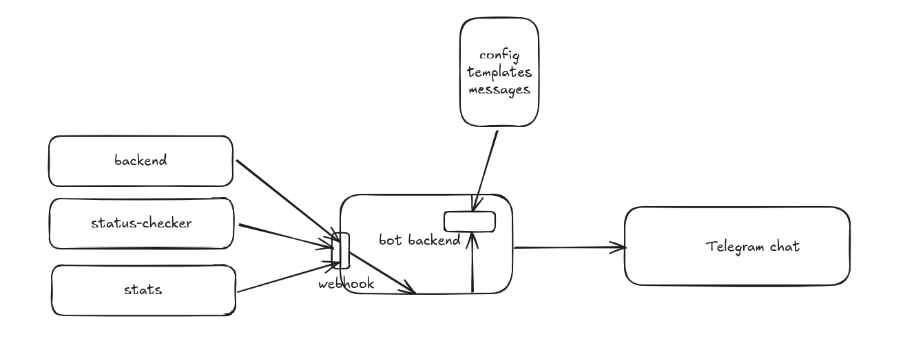

# Telegram Webhooker Bot

This is a Telegram bot system that receives webhook requests from various hosts and forwards formatted messages to Telegram chats.

## Architecture




- **Webhook Receiver**: Receives HTTP requests from different hosts
- **Bot Backend**: Processes messages and sends them to Telegram
- **Configuration**: Manages message templates and host mappings

## Setup

1. Install dependencies:
```bash
go mod tidy
```

2. Configure your bot in `config/config.yaml`

3. Run the bot:
```bash
go run cmd/main.go
```

## Configuration

Edit `config/config.yaml` to configure:
- Message templates for different hosts
- Host-specific configurations

## Endpoints

- `POST /webhook/{host}` - Receive webhook from specific host
- `GET /health` - Health check endpoint
